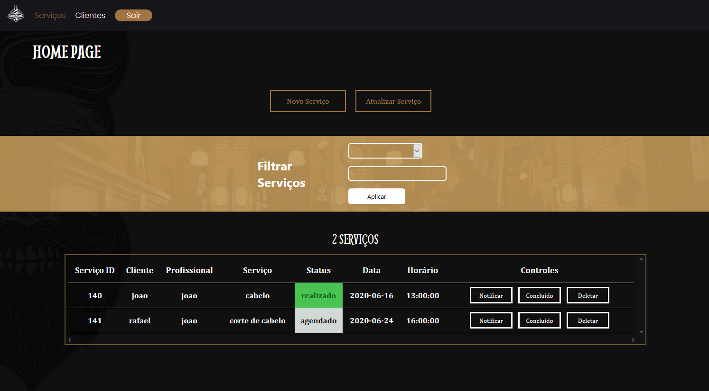
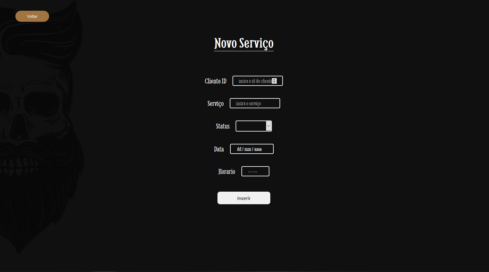
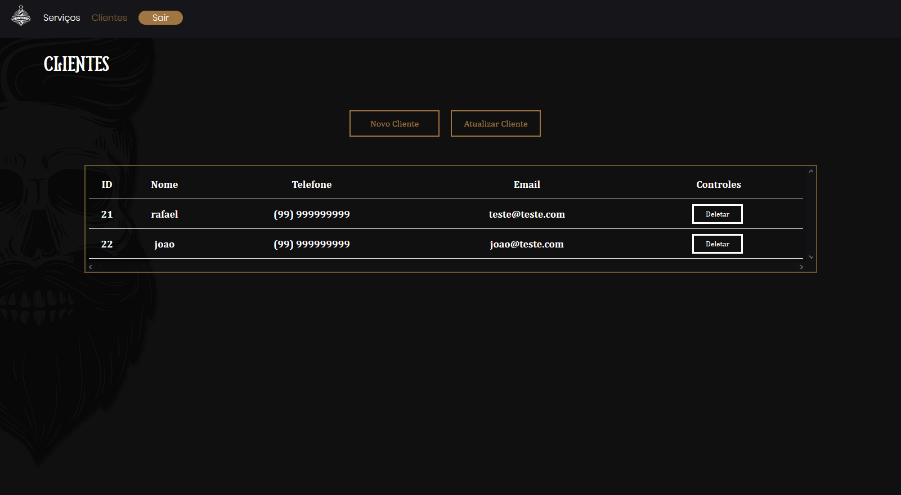
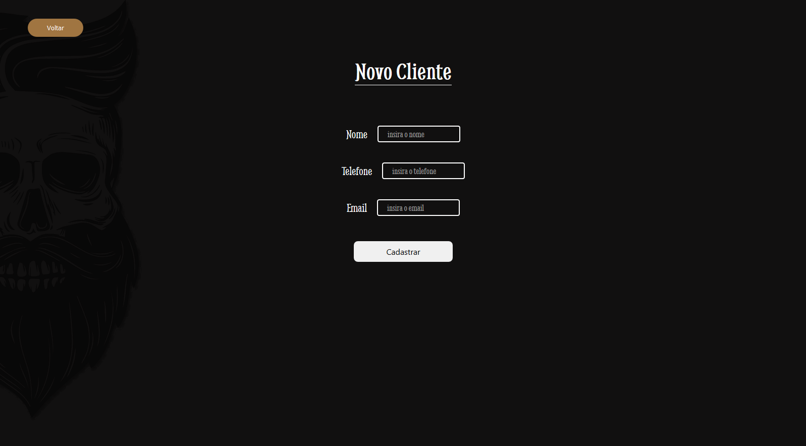
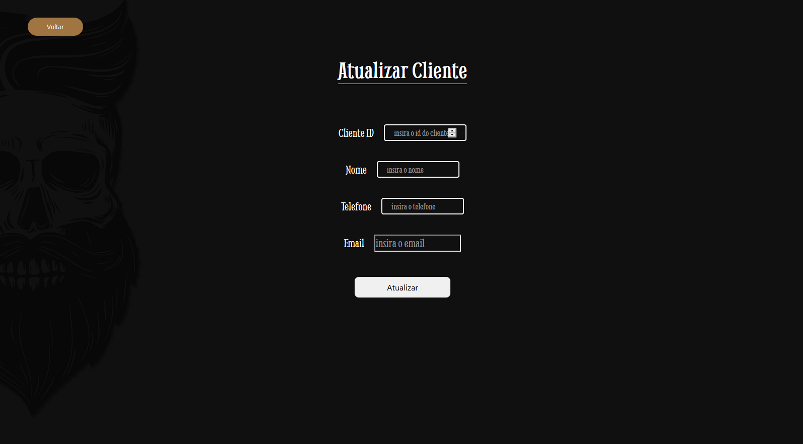

# barbearia-front

## Sobre
O proteto barbearia é um sistema para controle de servicos e clientes de uma barbearia, esse repositório é o front-end do projeto, desenvolvido utilizando:
* [Vue](https://vuejs.org/) na sua versão 2.6.11
* [Vue-Router](https://router.vuejs.org/) na sua versão 3.3.1
* [Barbearia-API](https://github.com/JohnBortotti/projetoBarbeariaAPI) desenvolvida para este projeto

## Instalação e configurações 
#### Instalando dependências
```
npm install
```

#### Compiles and hot-reloads for development
```
npm run serve
```

#### Compiles and minifies for production
```
npm run build
```
## Telas e Funcionamento
* ### Login
Na tela de login, as credenciais do usuário são enviadas para a API, se coincidirem com registros do banco de dados o usuário é redirecionado para a tela Home

</a>

* ### Home - Serviços
Nesta tela, já são listados diretamente todos os serviços registrados no banco em uma tabela, podendo ser filtrado por qualquer um dos filtros indicados, contendo 3 controles, o primeiro, "Notificar" envia um e-mail de confirmação do agendamento para o cliente, o segundo "Concluido", altera o status do serviço para 'realizado', já o terceiro, como o nome sugere, deleta o resgistro daquele serviço.

</a>

Exemplo de filtro:<br>
Na imagem, os serviços exibidos são aqueles em que o campo "status" tem o valor "agendado", exibindo assim, apenas os serviços agendados

</a>

 O botão "novo serviço" redireciona o usuário para um formulário para inserção de um novo serviço, e o botão "atualizar serviço" redireciona para um formulário para a atualização de um serviço já registrado

</a>

* ### Clientes
Nesta tela são listados todos os clientes em uma tabela, contendo 1 controle, com a funcionalidade de deletar aquele cliente

</a>

O botão "Novo Cliente" redireciona o usuário para um formulário para inserção de um novo cliente

</a>

já o botão "Atualizar Cliente" redireciona o usuário para um formulário para atualizar as informações de um cliente

</a>

## Sugestões de implementação

* #### Agendamento pelo cliente
Essa sugestão consiste em implementar um sistema no qual o próprio cliente possa acessar um formulário, preencher seus dados e agendar o serviço desejado, e o serviço automaticamente checaria a disponibilidade, e incluiria o serviço na agenda da barbearia

* #### E-mail de confirmação (Já implementada)
Essa sugestão consiste em implementar o envio de um e-mail de confirmação para o cliente, confirmando o agendamento do serviço e relembrando o mesmo a comparecer na barbearia para realizar o serviço